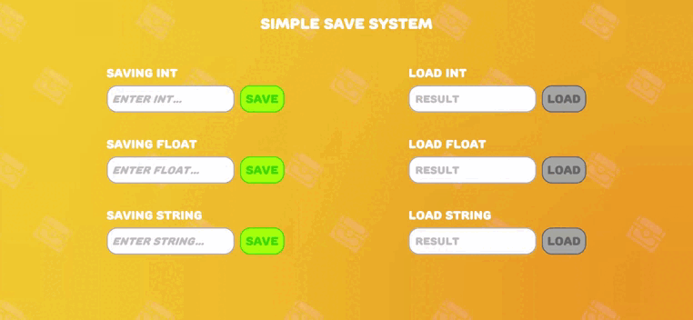

# SimpleSaveSystem

SimpleSaveSystem is a lightweight and easy-to-use saving system for Unity that allows you to save, retrieve, and delete data. It uses JSON format to store the saved data and ensures that data is saved persistently across game sessions.

## Features
- Save and retrieve any data type (using generics).
- Delete saved values.
- Check if a saved file exists.
- Works with Unity's persistent data path to store data safely.
- Editor utility to clear saved data.

## Installation
1. Download and import the `SimpleSaveSystem.unitypackage` into your Unity project.
2. You can now use the `SimpleSaveSystem` in your scripts to store and retrieve data.

## How to Use

### Set a Value
To save a value, use the `Set<T>` method, where `T` is the data type of the value you wish to save. It will save the value with a unique name (key).

```csharp
SimpleSaveSystem.Set<int>("playerScore", 100);
```

### Get a Value
To retrieve a saved value, use the `Get<T>` method, where `T` is the data type of the value. If the value doesn't exist, it will return the default value you specify.

```csharp
int playerScore = SimpleSaveSystem.Get<int>("playerScore", 0);
```

## Author

Developer: **Betoraf**


